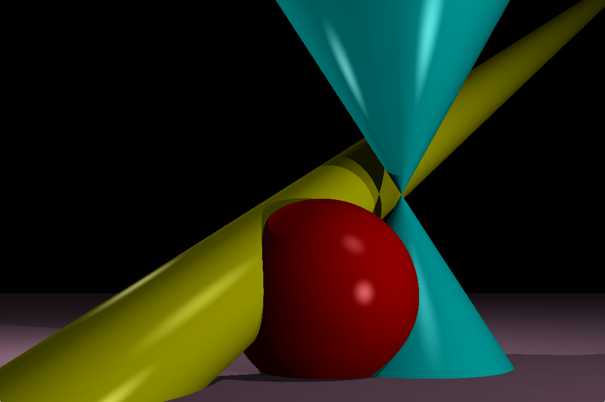
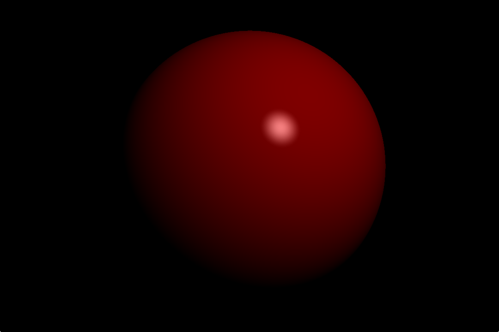
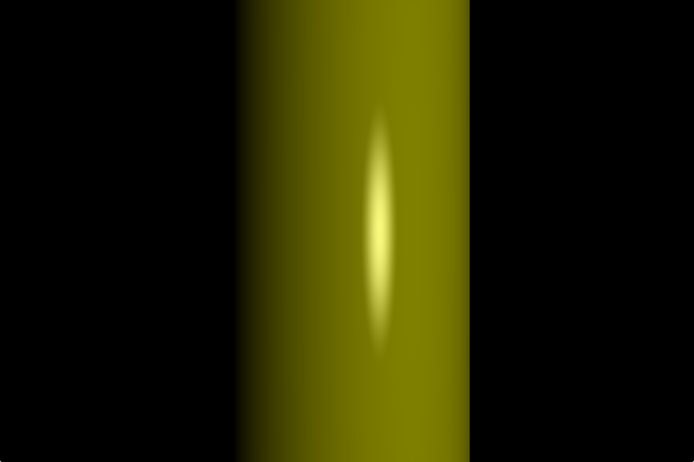
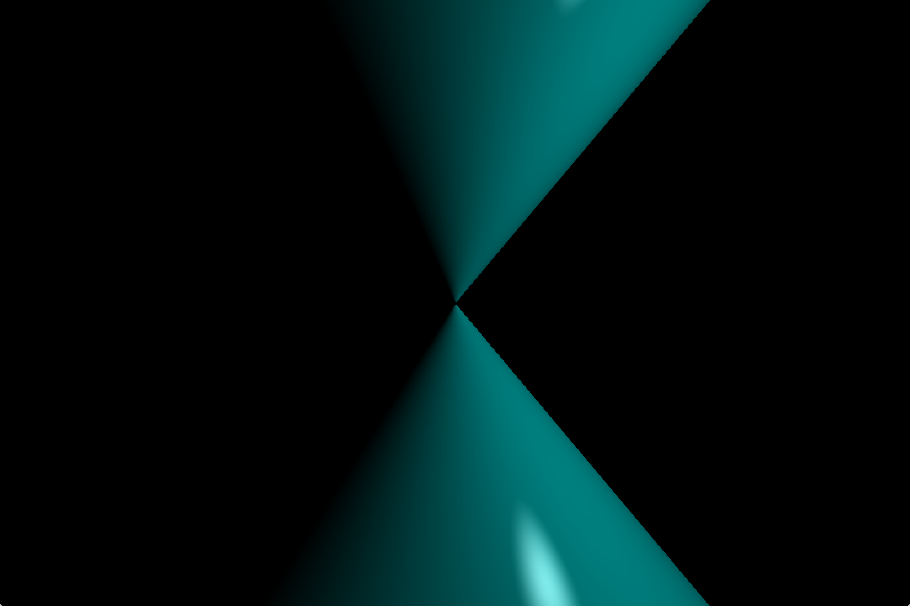
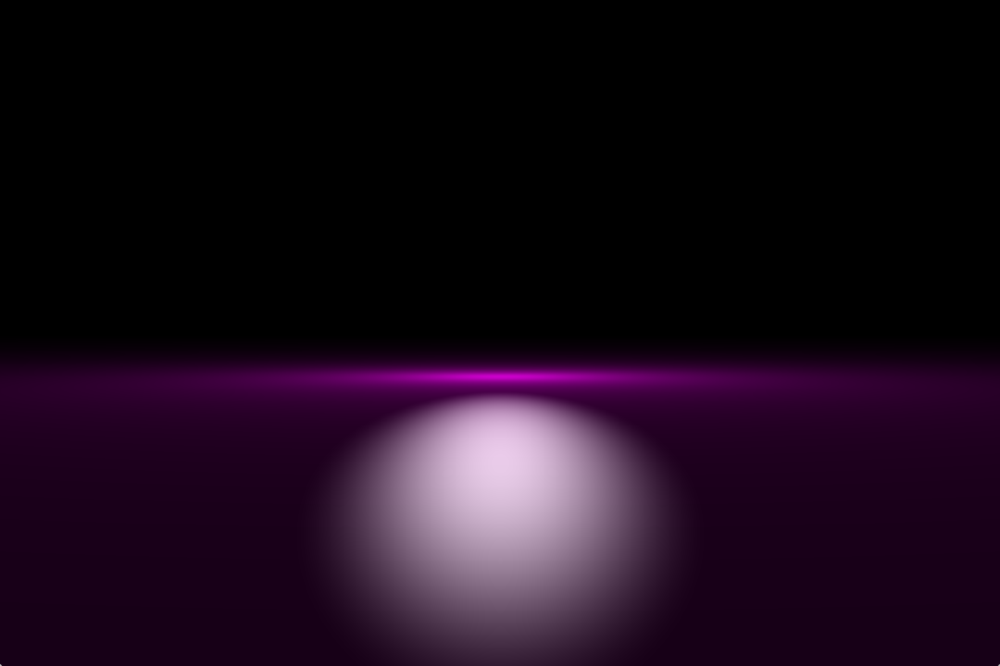
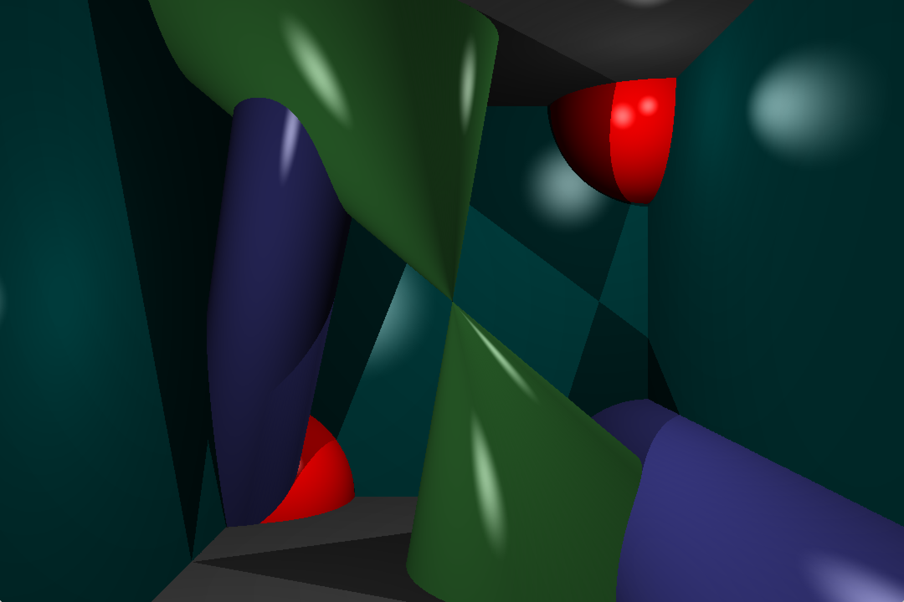
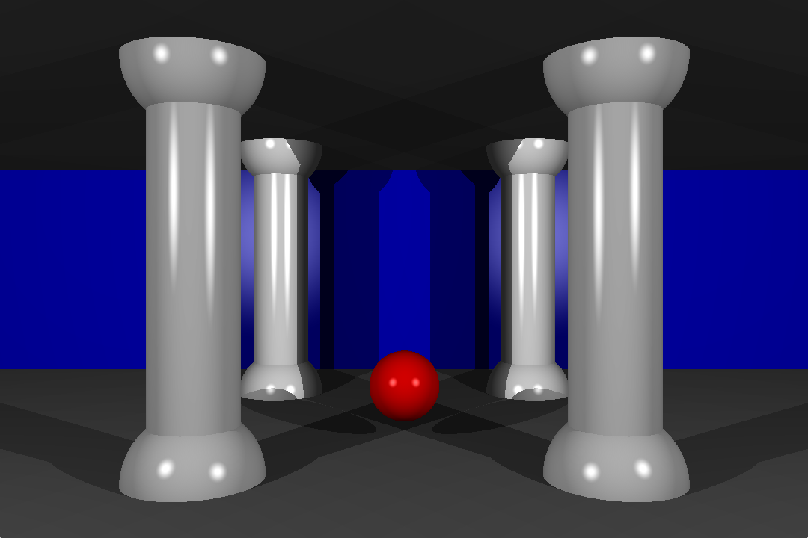
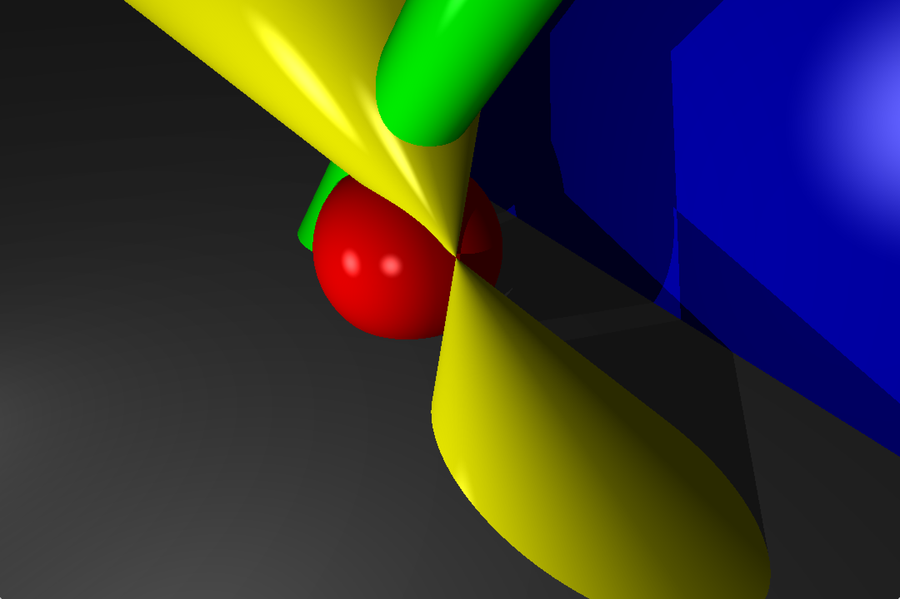
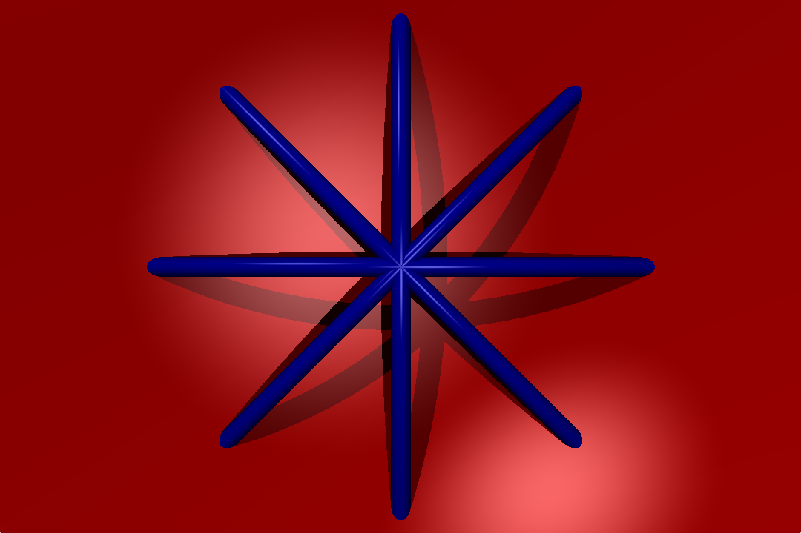

# RTv1
RTv1 is a simple ray tracing program. The project was developed as a part of 42 school program.
It parses a 3D scene forom a file and applies ray tracing algorithm to render the given scene.  
*Note:* this project was made for MacOS.  

## Instalation
Clone or download this repository and run `make` in command line while in the root of the repository. This will build executable called RTv1. Makefile compiles SDL2 library from source files (as stated in the subject, see [rtv1.en.pdf](rtv1.en.pdf)) so building process might take some time.

## Usage
`./RTv1 [filename]`  
`filename` must contain path to a valid scene.  
If the scene is not valid, RTv1 will write corresponding error on standard output.

## Scene Syntax
Scene is a file which describes camera, lights and geometric objects that have to be rendered.
This project can render such geometric shapes:  
- Sphere;
- Infinite Plane;
- Infinite Cylinder;
- Infinite Cone.  
  
Each of these entities is defined in a single line that consists of corresponding name and space separated parameters
that describe current entity. Order of the parameters has to match the order in definition examples below.

 ### Vector Syntax
 Some of the parameters have to be vectors.  
 Vectors have to be written as a sequence of three integer or floating point numbers, delimited with `,`.  
 For examle, `42,-5,3.14` is a vector with such components: `x == 42.0; y == -5.0; z == 3.14`.
 
 ### Rotations
 Rotations are also written in vector form. In rotation vectors each component defines the angle of rotation in degrees around corresponding axis. Rotations are applied by the right hand rule in the next order:
 1. Rotate around x;
 2. Rotate around y;
 3. Rotate around z.  
   
 For example, vector `10,18,-4.5` means: `Rotate around x axis by 10˚(counterclockwise), then rotate around y axis by 18˚(counterclockwise), then rotate around z axis by 4.5˚(clockwise)`. All rotations are applied around local origin of the entity which is being rotated.
 
 ### Camera Definition
 Camera is defined via such sequence of space separated parameters:  
 `cam: [position_vector] [rotation_vector]`  
 `cam:` is the name of camera entity. It must be rewritter to letter and preside the camera definition.  
 `[position_vector]` defines camera origin in world coordinates.
 `[rotation_vector]` defines rotation of ca...
 
 ### Light Definition
 
 ### Object Definition

## More Screenshots
Demo1:  

Demo2:  

Demo3:  

Demo4:  

Demo5:  

Demo6:  

Demo7:  

Inside sphere:  

